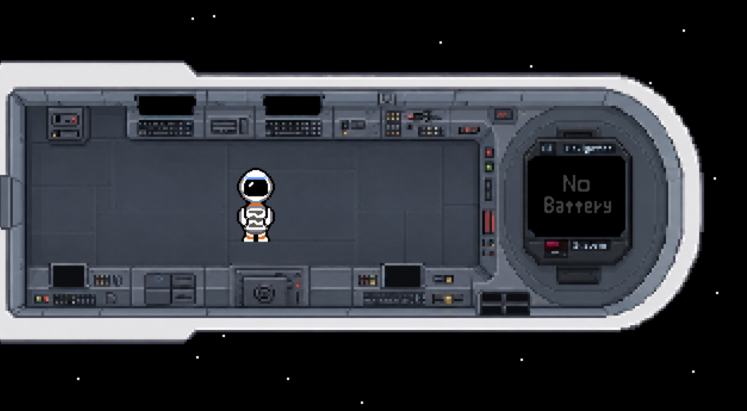
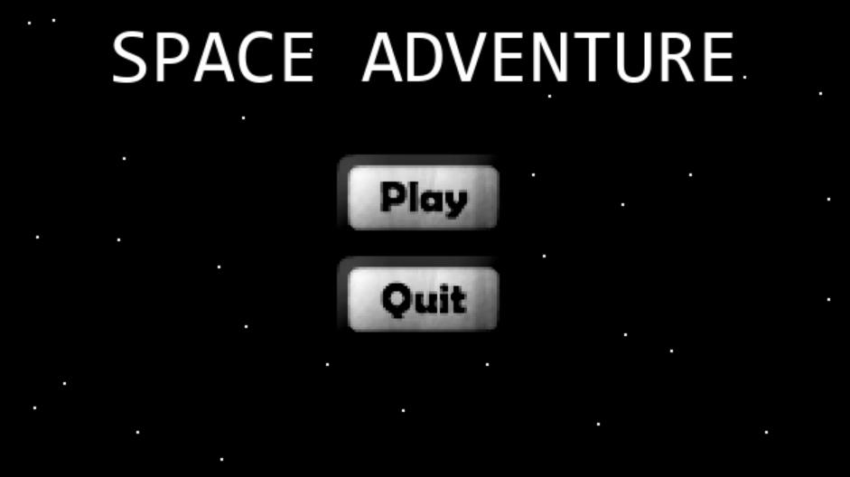

# Spacecraft Navigation Puzzle

An immersive real-time puzzle game built for Hoobit Hacks 2026. Navigate a damaged spacecraft away from a collapsing star while managing a passive-aggressive onboard AI that’d rather taunt you than help.

## Core Features

- **Asynchronous AI System**
    - Built with Python `asyncio`
    - Smooth 60 FPS game loop
    - Non-blocking Google Gemini API calls

- **Dynamic Space Mechanics**
    - Mouse-driven puzzle controls
    - Drag-and-drop vector navigation
    - Precise physics-style gameplay in Pygame

- **Atmospheric 16-Bit Soundscapes**
    - Retro synth scores
    - Ambient space audio layers
    - Polished audio design for immersion

## Tech Stack

- **Engine:** Pygame + `pygame.mixer`
- **Concurrency:** `asyncio`
- **LLM Integration:** Google Gemini REST API (`gemini-2.0-flash`)
- **Network:** Non-blocking calls via `urllib.request` executors

## Quick Start

### Prerequisites

- Python 3.11 or newer

### Setup

```bash
git clone https://github.com/AbdullahBaaqeilDev/hoobit_2026_AbdullahBaaqeilDev.git
cd hoobit_2026_AbdullahBaaqeilDev
pip install pygame asyncio
python main.py
```

> Note: This project does not hardcode API keys. Configure your environment variables or local inputs securely before running.

## Audio Credits

- **Composer:** HydroGene
    - Asset Pack: High Quality 16-bit RPG Music

- **Composer:** JDSherbert
    - Asset Pack: Ambiences Music Pack [FREE]

### In-Game Audio

- HydroGene — *18. The Old Magician* — Main Menu & UI
- HydroGene — *25. Dark Factory* — Core Puzzle Gameplay
- JDSherbert — *Frost Mountain Aura* — Background Cabin Room Hum

## Hackathon Notes

Built entirely during Hoobit Hacks 2026. All asynchronous task handling, UI rendering, and API integration were designed and implemented from scratch.


